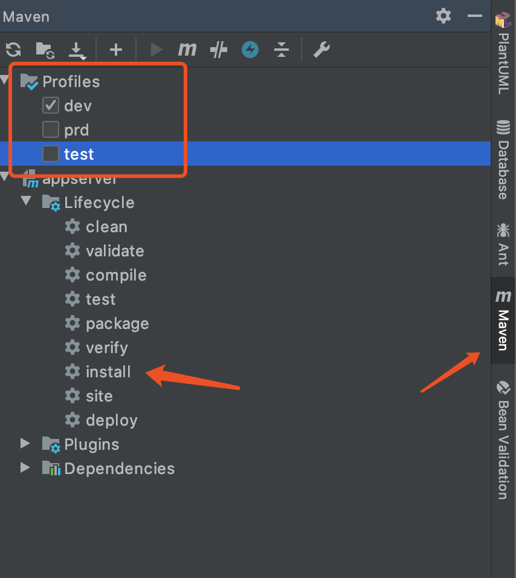
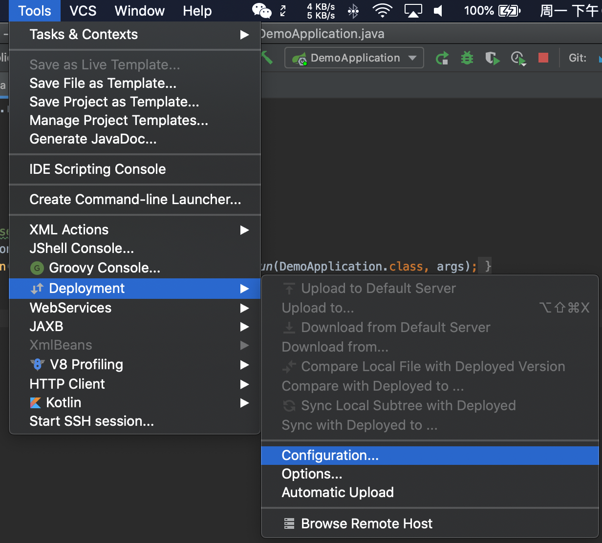
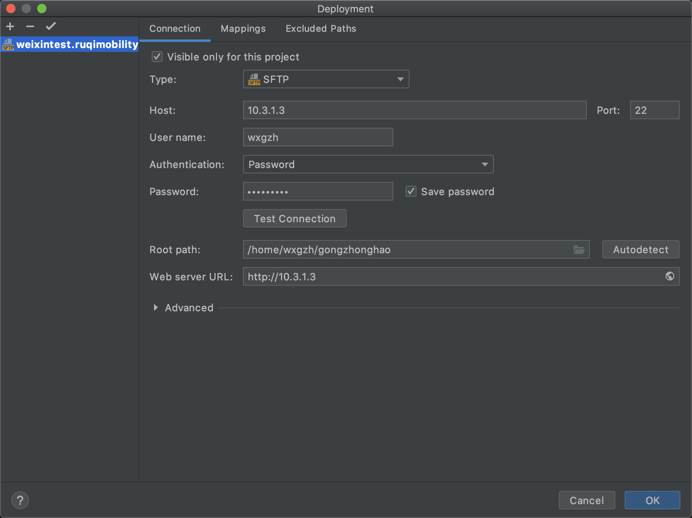
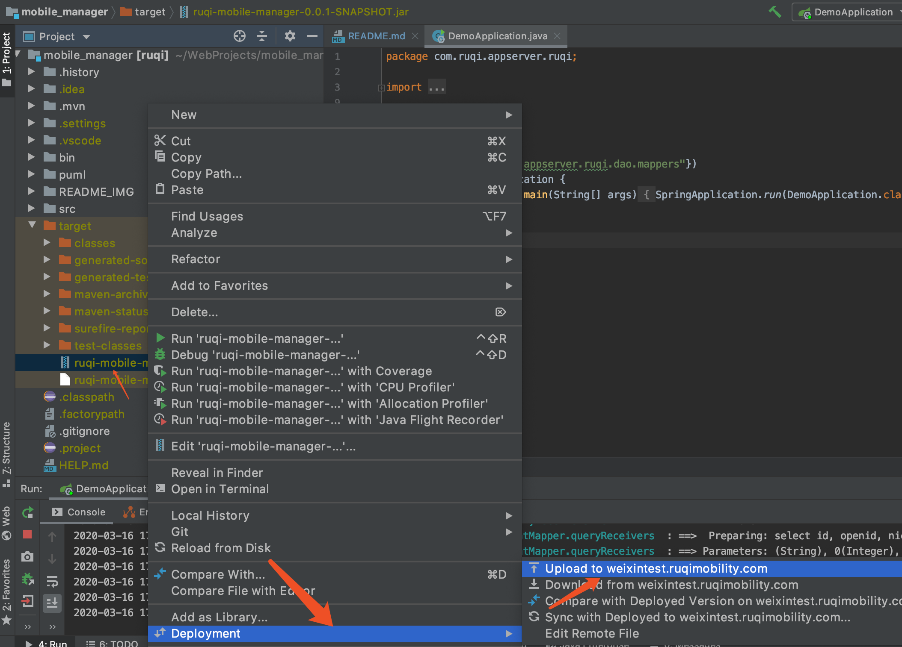

## APP记录平台项目说明
该项目基于JDK1.8 + SpringBoot2.2.4 + Mybatis1.3.0 + Mysql8.0.11 + Swagger2.9.2 + fastjson1.2.47 + layui2.5.6开发，用于开发如祺出行客户端APP记录平台相关功能，记录应用安全、数据等信息以实现安全统计报警分析、应用数据统计、性能体验优化等。

### 开发环境搭建
#### IDE
VSCode、IntelliJ IDEA、WebStorm等等，推荐使用IntelliJ IDEA。后续说明都以IntelliJ IDEA为例。

#### 依赖
该项目使用到的第三方依赖库基本都在根目录下的pom.xml中用maven的方式进行配置。
 
第一次打开项目或变更依赖配置后，BuildProject会自动进行依赖库的下载。

#### 运行
同普通JAVA程序，在IDEA中运行`DemoApplication`类中的`main`方法，就能运行该项目的全部服务。
 
该项目将接口API与管理中后台集成在一起，运行后接口API与中台都能访问。如[中台主页](http://localhost:8080/)、[API接口](http://localhost:8080/wechat/receiver/list/)

#### 调试
开发过程中难免会遇到调试代码的情况，而该项目的主要语言是JAVA、HTML等，所以其调试手段与JAVA项目、前端开发一致。
 
JAVA日志在IDEA中的Console控制台能看到。项目根目录下的myapp.log文件中也会保存所有的日志信息，便于查看线上日志。

### 线上部署
#### 环境说明
application.properties文件中增加配置：`spring.profiles.active=@profiles.active@`
 
pom.xml文件中配置profiles下dev、test、prod三种环境，resources目录下创建三个环境的配置文件application-${env}.properties，不同环境下可以分别设置不同的属性。***默认***使用***dev***配置。
 
目前正式环境配置禁用了Swagger插件、sql语句log的功能，其他的如端口、数据库等配置均一致。
#### 打包
* IDEA操作打包，在右侧Maven工具箱中选择对应的环境，点击install即可：
 

* 命令行打包，在项目根目录下执行命令：
`mvn clean package -P {env}`, 如`mvn clean package -P prod`

则会在项目下target目录下生成对应的jar包（微服务部署使用jar包，jar包名字在pom.xml中可以配置，但是名字与后续部署、脚本运行等有关）。

#### 发布
目前项目的发布指打正式包发布在公司测试服务器上的流程。需要注意打包时要选择prod环境。

##### 上传jar到服务器
* 方式一：手动命令行上传到服务器，如下命令中第二个参数为jar包在电脑本地的绝对路径，大家需要修改成自己的。
`scp /Users/zhangyu/WebProjects/mobile_manager/target/ruqi-mobile-manager-0.0.1-SNAPSHOT.jar wxgzh@10.3.1.3:~/gongzhonghao/`
会要求输入服务器的密码，然后等待上传成功即可。
* 方式二：IDEA的deployment功能。先进行配置，后续打包好后，操作upload到配置好的服务器的对应目录下。
 

 

 

 

##### 运行最新版本jar
mac系统，命令行`ssh wxgzh@10.3.1.3`，输入密码登录服务器。
 
`cd gongzhonghao/`进入目录，执行脚本`sh service.sh status`可以查看服务状态，`sh service.sh stop`停止服务，`sh service.sh start`开启服务，则完成了此次更新部署重启服务。
运行后，可以访问一下中台验证部署是否成功生效。
 

##### 查看线上日志
服务器目录下gzh.log、myapp.log均记录线上日志。
`tail -f ${filename}`命令，查看实时日志信息。

### 代码框架说明
* bean对象建议放置在com.ruqi.appserver.ruqi.bean目录下
* 数据库对象entity建议放在com.ruqi.appserver.ruqi.dao.entity下
* config目录放配置类
* controller目录放控制类，如接口API、html
* com.ruqi.appserver.ruqi.dao.mappers目录下放数据库相关类，定义数据库操作方法。
 
    数据库操作sql可以放在这里面使用注解的方式，也可以在resources/mappers目录下的xml中写sql。
    * 注解方式优点：简单便捷，不需要xml中的一大堆配置。
    * xml方式优点：sql统一管理，与java业务代码抽离。写复杂sql更方便。
* com.ruqi.appserver.ruqi.interceptor目录下放拦截器，新增加的拦截器需要在com.ruqi.appserver.ruqi.config.MyWebAppConfigurer中添加。
* com.ruqi.appserver.ruqi.network目录放网络相关
* com.ruqi.appserver.ruqi.service放api接口等逻辑的实现代码相关。
* com.ruqi.appserver.ruqi.utils工具类。
* resources/sql目录下放数据库表对应的sql语句。

### 第三方插件功能说明
#### Swagger
Swagger插件，规范开发者的代码，自动生成对应的接口文档，且能直接在线进行接口调试。一般情况下部署后本地访问路径为`http://localhost:8080/swagger-ui.html`。
 
大家可以自行百度或[官网](https://swagger.io/)进行了解。

#### layui
经典模块化前端框架。由职业前端倾情打造，面向全层次的前后端开发者，低门槛开箱即用的前端 UI 解决方案。该项目使用最新版2.5.6。
 
大家可以自行百度或[官网](https://www.layui.com)进行了解。

#### PUML
plantUML是一个可以很方便的进行编码生成流程图的工具，需要安装PlantUML integration插件。文件统一放在puml目录下，以.puml结尾。
梳理逻辑写plantUML可以帮助开发者自己梳理流程逻辑，更能便于他人快速理解逻辑流程。
 
大家可以自行百度或[官网](https://plantuml.com/)进行了解。也可以选用其他工具、增强代码注释等达到让大家都能清晰理解代码逻辑的目的。

